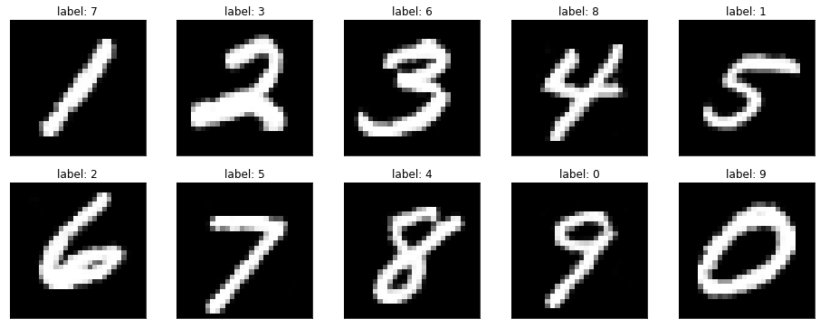
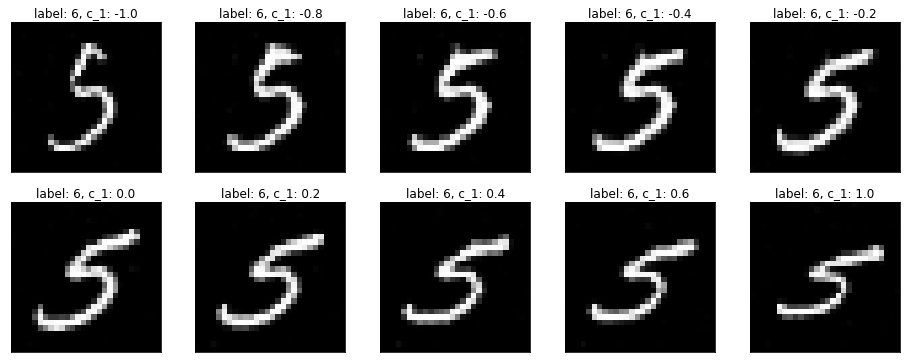

# Build-InfoGAN-From-Scratch
GANs are widely used for synthesizing new data, especially images. However, one drawback of normal GANs is that we have no control over the images GANs produce. For instance, a GAN that is trained to produce fake hand-written digit images may be able to generate very real hand-written digit images, but we have no control over which number it generates. **InfoGAN solved this problem: the network can learn to produce images with specific categorical features (such as digits 0 to 9) and continuous features (such as the rotational angle of the digits), in an unsupervised manner. In addition, because the learning is unsupervised, it is able to find the patterns hidden among the images, and generate images that follow these hidden patterns.** Sometimes the model can learn very interesting patterns that are beyond your imagination (for example, one of my models learns to transit from number 2 to number 8. You will see it later!). In this notebook, I will introduce how InfoGAN achieves the control of the images being produced, and how to build an InfoGAN from scratch to synthesize feature-specific MNIST hand-written digits.

I've also posted an article on [Medium.com for this topic](https://towardsdatascience.com/build-infogan-from-scratch-f20ee85cba03).
## Key Results:
1. This model can produce different images of numbers when given different categorical labels:

2. This model can also change the shape of the number by varying the continuous latent code:

